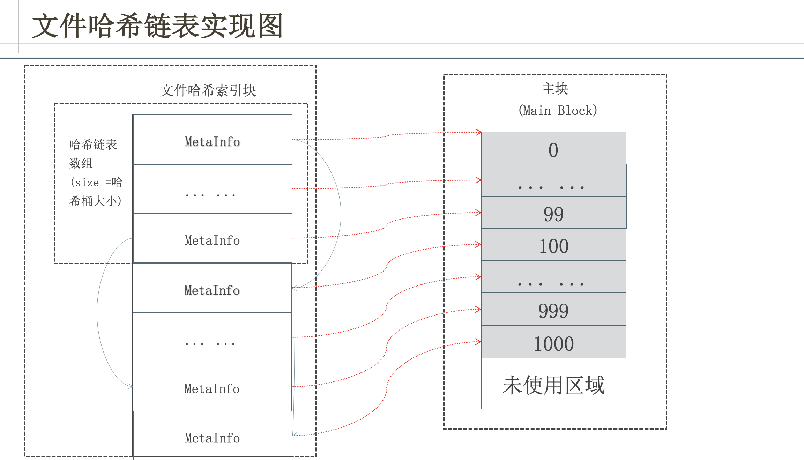

# FileSystem_Store_Engine
## 一、项目架构

- IndexHandle通过MMapFileOperation来操控映射到内存中的索引文件。
- MMapFileOperation继承自FileOperation，同时配合MMap_File这个对象来操作映射到内存中的数据
  - 通过MMap_File可以在MMapFileOperation的构造函数中调用MMap_File对象并将文件映射到内存。然后在别的函数中（pRead，pWrite，flush）可知道文件是否已经映射到内存，以此判断pWrite，pRead，flush_file是该使用MMapFileOperation的函数还是基类FileOperation的函数版本。
  - 通过FileOperation可以打开文件、关闭文件、读写文件（提供内存映射版本的读写）、把文件立刻写入磁盘保存、缩小/截断文件、跳跃式的读取文件

### 1.1 IndexHandler
- IndexHandle架构图：

- IndexHandler由「IndexHeader + MetaInfo哈希链表」两个部分组成。IndexHandler通过参数block_id和"."组成path，然后配合MMapFileOperation对象mmap_file_op，可以对索引文件（IndexHeader+MetaInfo）进行创建、加载、移除、保存至磁盘的操作。
- 由于MMapFileOperation是FileOperation的派生类，因此对索引文件的具体操作方式还会根据索引文件I/O方式的不同而改变。通过文件映射方式则会调用MMapFileOperation中的文件操作接口，如果是普通的I/O，则会调用基类FileOperation的文件操作接口。（但索引文件一般是在IndexHandler的create、load中默认被mmap_file_op通过文件映射的方式进行I/O。）
- IndexHandle对索引文件（IndexHeader+MetaInfo）进行的操作是基于外部对于块文件的改动而进行的操作。即：
  - 当初始化/新增块文件时，就会初始化一个相应的索引文件；
  - 当读取一个块文件信息时，需要加载索引文件到内存，然后根据索引文件的信息访问磁盘。
  - 当写入一个新的文件进入块文件时，就需要加载索引文件内存、修改索引文件（修改 BlockInfo、MetaInfo、IndexHeader中的其他信息）
  - 当删除一个块文件时，就需要把MetaInfo文件加入可重用结点列表，块文件则做标记，之后积累到一定数量时统一删除。
- 为了实现上述操作（create、load、remove、flush）：
  1. 该类对象会提供操作MetaInfo的接口：write_segment_meta、read_segment_meta、delete_segment_meta。
  2. 同时，为了使用哈希链表数据结构保存MetaInfo，提供接口：hash_find，hash_insert。
  3. 提供修改block_info的接口update_block_info。
  4. 提供修改IndexHeader中data offset信息的接口commit_block_data_offset
- 块文件BlockInf、MetaInfo的定义以及哈希链表结构的使用见最下面的「其他」部分。
- 各个函数的具体功能见函数的注释。

### 1.2 MMapFileOperation
- MMapFileOperation是FileOperation的派生类。继承了后者对文件操作的接口，同时配合MMapFile对象可以把数据映射到内存中。同时，它能够判断数据是否被映射在内存，如果映射在内存，则使用自身重写的函数来进行read、write，（不经过页缓存，直接memcpy内存的data）以及flush。如果没有映射在内存，则使用基类的read、write、flush。

### 1.3 FileOperation
- FileOperation可以直接从磁盘打开文件，并进行读取/写入等操作(但还是会经过内存，即磁盘->内核缓存->用户进程)，但是只要程序运行期间不崩溃，那么所有的read、write操作都会最终保存到磁盘中去。该类是MMapFileOperation的基类。
- 可以打开文件、关闭文件、读写文件、把文件立刻写入磁盘保存、缩小/截断文件、跳跃式的读取文件

### 1.4 MMapFile
- MMapFile会把文件fd_映射到内存中，通过私有成员data_记录内存地址，size_记录已经映射的内存的大小，同时mmap_file_option_记录映射规则。使用MMapFile需要显示地通过fd初始化MMapFile。
  - 提供接口map_file、munmap_file、remap_file分别用于映射fd、解除映射fd_、以及为映射了的fd_扩容/缩容。
  - 提供接口get_data与get_size用于外部访问映射的内存和得到映射的内存的大小
  - 提供接口sync_file用于同步内存中的数据到磁盘中


## 二、块初始化 - block_init_test.cpp
1. 设置mmap_option，块大小，哈希桶大小
2. 生成索引文件：
    1. 输入block_id并且用此初始化IndexHandler。
    2. 调用IndexHandler的create函数，创建索引文件。
3. 生成主块文件：
    1. 用由“./block_id"组成的path，模式选择O_RDWR | O_LARGEFILE | O_CREAT，调用FileOperation初始化主块文件指针，main_block。
    2. 通过指针调用fTruncate_file(main_block_size)，调整大小。（如果没open会先自动调用open函数打开/创建文件）
    3. 调用close()将main_block文件关闭

## 三、块的读取 - block_read_test.cpp
1. 设置mmap_option，块大小，哈希桶大小
2. 加载索引文件：
   1. 输入block_id并且用此初始化IndexHandler。
   2. 调用IndexHandler的load函数，加载索引文件。
3. 读取MetaInfo的信息，定位块文件的位置：
   1. 通过file_id和index_handler中的read_segment_meta(file_id, meta)函数，将MetaInfo的信息写入参数meta中。
4. 创建FileOperation的指针，main_block。并通过pRead_file(buffer, meta.get_size(), meta.get_offset)函数将主块文件的内容读取到参数buffer中。最后在buffer的末尾加入'\0'作为结束符。
5. 最后关闭main_block指向的文件，删掉main_block指针与index_handler指针。

## 四、块的写入 - block_write_test.cpp
1. 设置mmap_option，块大小，哈希桶大小
2. 加载索引文件：
   1. 输入block_id并且用此初始化IndexHandler。
   2. 调用IndexHandler的load函数，加载索引文件。
3. 写入文件内容：
   1. 通过index_handler的get_data_file_offset()找到主块文件中的未使用数据的起始偏移：data_file_offset
   2. 通过index_handler->block_info()->seq_no_找到下一个可分配的主块文件的编号：file_no
   3. 分配一块buffer记录主块文件的信息。
   4. 然后将这个buffer的内容通过FileOperation的函数pWrite_file(buffer, sizeof(buffer), data_file_offset)，以data_file_offset为偏移量，写入主块文件。
4. 更新索引文件的头部信息（Index Header）（即块信息（block_info），未使用数据的起始偏移量，索引文件当前偏移量，可重用结点链表等），然后在索引文件中写入MetaInfo
   1. 通过write_segment_meta(meta_info.get_key(), meta_info)写入信息到MetaInfo中
   2. index_handler->commit_block_data_offset(sizeof(buffer))更新索引文件头部信息中的block_data_offset，表示块文件的最新偏移量。
   3. index_handler->update_block_info(largefile::C_OPER_INSERT, sizeof(buffer))更新索引文件头部信息中的块文件信息
5. 用index_handler调用flush把当前内存中的更改保存在磁盘中

## 五、块的删除 - block_delete_test.cpp
1. 设置mmap_option，块大小，哈希桶大小
2. 加载索引文件：
   1. 输入block_id并且用此初始化IndexHandler。
   2. 调用IndexHandler的load函数，加载索引文件。
3. 删除指定的meta_info，通过file_id确定meta_info，然后调用delete_segment_meta(file_id)删除meta_info。
   1. delete_segment_meta会把删除的节点加入可重用节点列表
4. 通过index_handler->flush()将更改保存到磁盘。

## 六、其他
1. common.h中定义了ErrorType，MetaInfo和BlockInfo
2. BlockInfo的结构：

3. MetaInfo的结构：


4. meta_info中的file_id对应块文件中存储的文件的编号。block_info中的block_id对应的是该块文件的id
5. meta_info的更改是通过接口：
   1. write_segment_meta(meta_info.get_key(), meta_info)
   2. delete_segment_meta(file_id)
6. MMapFileOperation构造函数中的open_flags = O_CREAT | O_RDWR | O_LARGEFILE（FileOperation中的open_flags = O_RDWR | O_LARGEFILE）
   1. O_CREAT表示打开时文件如果不存在会自动创建
   2. O_RDWR表示可读可写
   3. O_LARGEFILE表示可以打开大文件
7. mmap函数、munmap函数：
```
 void *mmap(void *addr, size_t length, int prot, int flags,
            int fd, off_t offset);
 int munmap(void *addr, size_t length);　
```
- 参数start：指向欲映射的内存起始地址，通常设为 NULL，代表让系统自动选定地址，映射成功后返回该地址。
- 参数length：代表将文件中多大的部分映射到内存。
- 参数prot：映射区域的保护方式。可以为以下几种方式的组合：
  - PROT_EXEC         执行    
  - PROT_READ         读取    
  - PROT_WRITE        写入   
  - PROT_NONE         不能存取

- 参数flags：影响映射区域的各种特性。必须要指定MAP_SHARED 或MAP_PRIVATE。
   - MAP_SHARED     － 映射区域数据与文件对应，允许其他进程共享
   - MAP_PRIVATE    － 映射区域生成文件的copy，修改不同步文件
   - MAP_ANONYMOUS  － 建立匿名映射。此时会忽略参数fd，不涉及文件，			      而且映射区域无法和其他进程共享。
   - MAP_DENYWRITE  － 允许对映射区域的写入操作，其他对文件直接写入		      的操作将会被拒绝。
   - MAP_LOCKED     － 将映射区域锁定住，这表示该区域不会被置swap

- 参数fd：要映射到内存中的文件描述符。如果使用匿名内存映射时，即flags中设置了MAP_ANONYMOUS，fd设为-1。有些系统不支持匿名内存映射，则可以使用fopen打开/dev/zero文件，然后对该文件进行映射，可以同样达到匿名内存映射的效果。
- 参数offset：文件映射的偏移量，通常设置为0，代表从文件最前方开始对应，offset必须是分页大小的整数倍。　
8. mmap的msync
```
函数原型
int msync ( void * addr, size_t len, int flags)
头文件
#include<sys/mman.h>   
```
- addr：文件映射到进程空间的地址；
- len：映射空间的大小；
- flags：刷新的参数设置，可以取值MS_ASYNC/ MS_SYNC
  - 取值为MS_ASYNC（异步）时，调用会立即返回，不等到更新的完成；
  - 取值为MS_SYNC（同步）时，调用会等到更新完成之后返回；
- 返回值：成功则返回0；失败则返回-1；    
9. mmap的mremap：扩大（或缩小）现有的内存映射
```
函数原型
void * mremap(void *old_address, size_t old_size , size_t new_size, int flags);

头文件
#include <unistd.h> 
#include <sys/mman.h> 
```
- addr：     上一次已映射到进程空间的地址；
- old_size： 旧空间的大小；
- new_size： 重新映射指定的新空间大小；
- flags:     取值可以是0或者MREMAP_MAYMOVE
  - 0代表不允许内核移动映射区域，  
  - MREMAP_MAYMOVE则表示内核可以根据实际情况移动映射区域以找到一个符合new_size大小要求的内存区域
- 返回值：成功则返回0；失败则返回-1；   
10. 哈希一致性（哈希环）。
11. 哈希桶数量选择质数
12. 哈希冲突的解决办法

## 七、优化效果：
### 正常读取：
  - inode节点大小 - 一般是128字节或256字节。inode节点的总数，格式化时就给定，一般是每1KB或每2KB就设置一个inode。一块1GB的硬盘中，每1KB就设置一个inode，那么inode table的大小就会达到128MB，**占整块硬盘的12.8%**。
- 大文件存储模式读取，索引的大小：
### 优化读取：
#### 1. block_info：
- size = 4+4+4+4+4+4+4 = 28byte
```
  uint32_t block_id_;             //块编号   1 ......2^32-1  TFS = NameServer + DataServer
  int32_t version_;               //块当前版本号
  int32_t file_count_;            //当前已保存文件总数
  int32_t size_;                  //当前已保存文件数据总大小
  int32_t del_file_count_;        //已删除的文件数量
  int32_t del_size_;              //已删除的文件数据总大小
  uint32_t seq_no_;               //下一个可分配的文件编号  1 ...2^64-1   
```
#### 2. IndexHeader：
- block_info + 4 + 4 + 4 + 4 = 28 + 16 = 44byte
```
      BlockInfo block_info_;		//meta的块信息, 28B
      int32_t bucket_size_;		//哈希桶大小, 4B
      int32_t data_file_offset_;	//主块文件中的未使用数据的起始偏移, 4B
      int32_t index_file_size_;	//索引文件的大小，同时也是偏移量(offset after index_header+all buckets),指向下一个待分配的索引文件位置, 4B
      int32_t free_head_offset_;	//可重用的链表节点（即之前删掉的节点，他们并未真的被删除，只是被标记了）,4B
```

#### 3. meta_info:
- 8 + 8 + 4 + 4padding = 24byte
```
uint64_t file_id_;                 //文件编号
struct                            //文件元数据
{
    int32_t inner_offset_;        //文件在块内部的偏移量
    int32_t size_;                //文件大小
} location_;
int32_t next_meta_offset_;        //当前哈希链下一个节点在索引文件中的偏移量
```
#### 4. IndexHeader + 哈希桶数量*哈希初始节点大小 + 哈希节点*文件数量n：
- 44byte + 1000 * 4byte + n*24byte  = (4044byte + 24n)
#### 5. 主块文件大小：
- 1024byte * 1024 * 64 = 67,108,864 = 64Mb

#### 6. 总占比：
占比 = (4044b + 24n) / 64Mb = 0.006026% + 24n/64Mb

   - 占比：**0.006026% + 24n/64Mb**